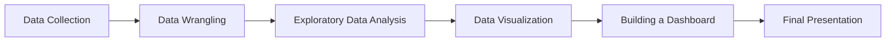

## 📊 **Correct Project Workflow Order:**

### **1. Data Collection** 📥
- **First step**: Gather data from various sources (APIs, web scraping, surveys)
- Files: `Collecting_job_data_using_APIs-Lab.ipynb`, `Web-Scraping-Lab.ipynb`, etc.

### **2. Data Wrangling** 🧹  
- **Second step**: Clean, transform, and prepare the data for analysis
- Files: `Finding Duplicates.ipynb`, `Removing Duplicates.ipynb`, `Normalizing Data.ipynb`, etc.

### **3. Exploratory Data Analysis (EDA)** 🔍
- **Third step**: Explore patterns, distributions, correlations in the data
- Files: `Exploratory Data Analysis.ipynb`, `Finding Correlation.ipynb`, etc.

### **4. Data Visualization** 📈
- **Fourth step**: Create charts and visual representations of insights
- Files: `Histograms.ipynb`, `Scatter Plots.ipynb`, `Bar Charts.ipynb`, etc.

### **5. Building a Dashboard** 📊
- **Fifth step**: Combine visualizations into interactive dashboards
- Files: `Survey_Dashboard.png`, `Survey_Dashboard.pdf`, etc.

### **6. Final Assignment - Present Your Findings** 🎯
- **Final step**: Create presentation and report summarizing all insights
- Files: `DataAnalystPresentation.pdf`

---

## 🔄 **The Complete Analysis Pipeline:**

**Summary**: The project should flow from left to right as shown above, starting with gathering raw data and culminating in a professional presentation of insights. This follows the standard CRISP-DM (Cross-Industry Standard Process for Data Mining) methodology used in data science projects.
